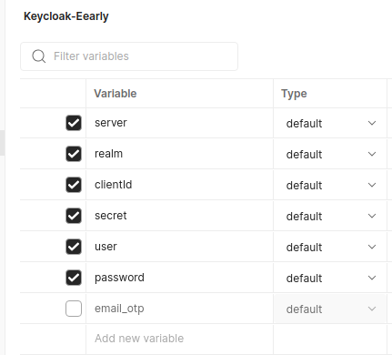
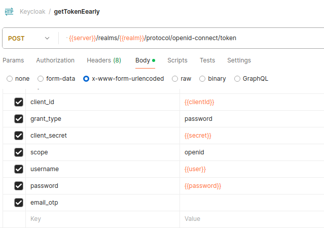
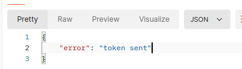
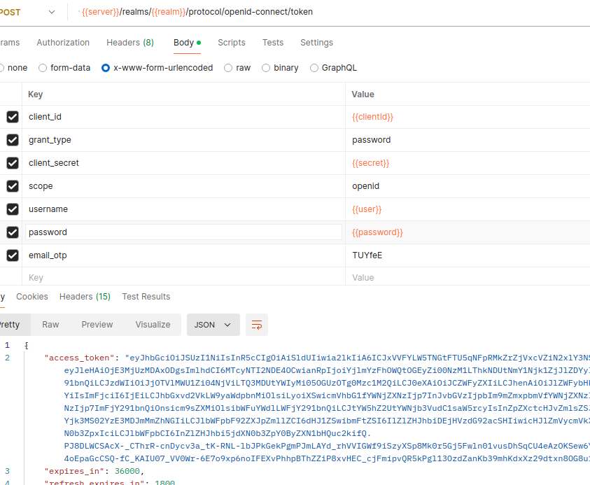

Java 22

(First time only) Run `docker compose up` in the **docker** folder 

To generate proto classes run `mvn generate-sources` / `mvn clean package -DskipTests`

## Maven Configuration

Ensure that your `settings.xml` file exists in the `.m2` root directory, which contains the server configuration for our repository.
<br/><br/>
Here is an example of what should be included:

   ```xml
   <settings xmlns="http://maven.apache.org/SETTINGS/1.0.0"
             xmlns:xsi="http://www.w3.org/2001/XMLSchema-instance"
             xsi:schemaLocation="http://maven.apache.org/SETTINGS/1.0.0 http://maven.apache.org/xsd/settings-1.0.0.xsd">
    <servers>
        <server>
            <id>si.result.r3.r3-snapshot</id>
            <username>[your_username]</username>
            <password>[your_password]</password>
        </server>
        <server>
            <id>si.result.r3.r3-release</id>
            <username>[your_username]</username>
            <password>[your_password]</password>
        </server>
    </servers>
    <!-- other settings -->
</settings>
```
Use your domain username and password. <br/>

## Getting JWT token for authentication in gRPC calls

1. Ask keycloak admin to crete account for you otherwise use your keycloak account data.

2. In Postman create new enviroment for Keycloak access.



- Add variables:
```yaml
server: https://keycloak.result.si
realm: eEarly
clientId: eearly-mobile
user: your keycloak user
password: your keycloak password
```

2. In Postman create new POST request:

- select enviroment created in 1.
- POST url:  {{server}}/realms/{{realm}}/protocol/openid-connect/token
- fill body parameters as in picture:


  
 - Send request. Response will be:



  - Check your email. Email with OPT should be sent by Keycloak. Copy OTP.
  - Paste received OTP in body parameter email_otp.
  - Make new call to get Keycloak token. Response should be:



  - Copy access_token value inside response.
  - Use this value in Authorization tab inside your gRPC request (Auth Type: Bearer Token).
  - gRPC call should be authenticated now.


### Generating Ehrbase classes

Ehrbase classes can be generated by running generator plugin inside eearly-common module.
